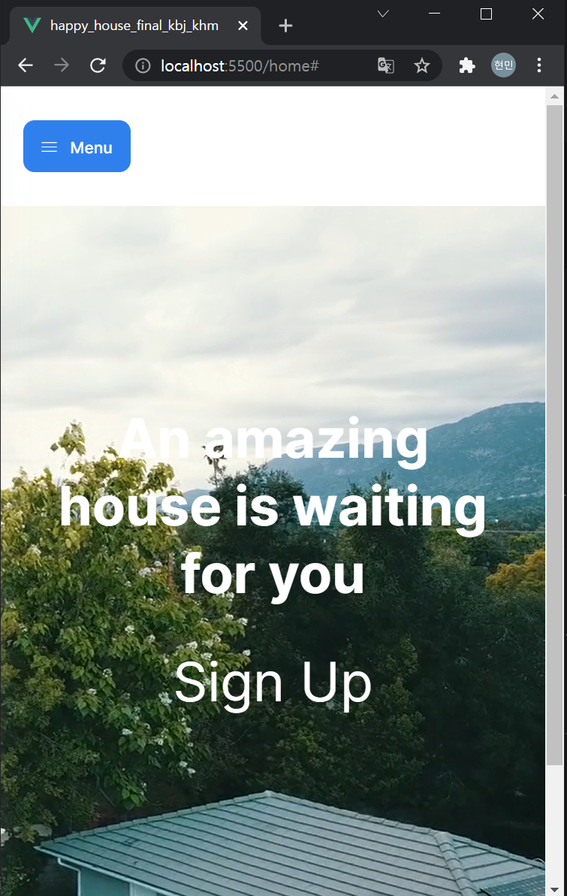
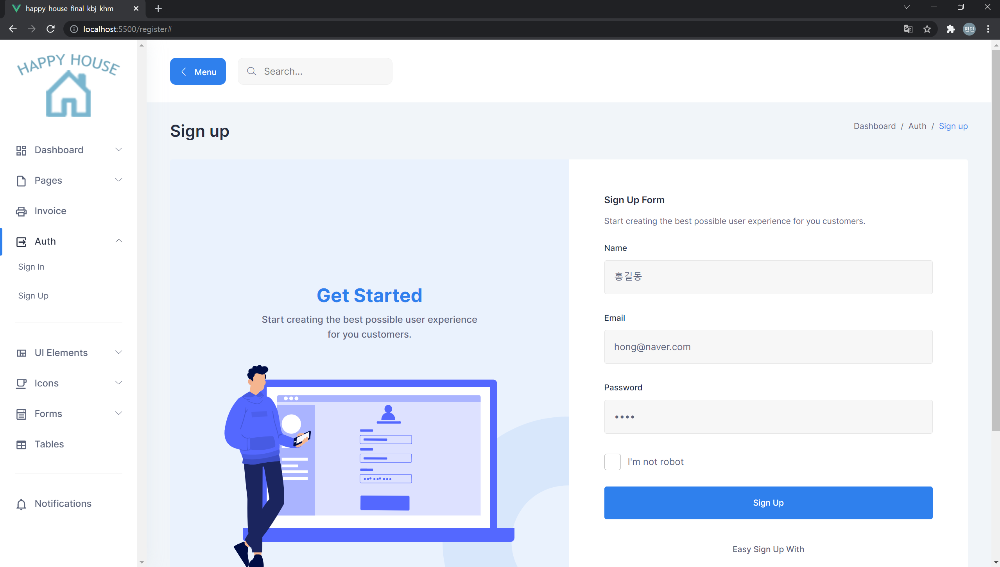
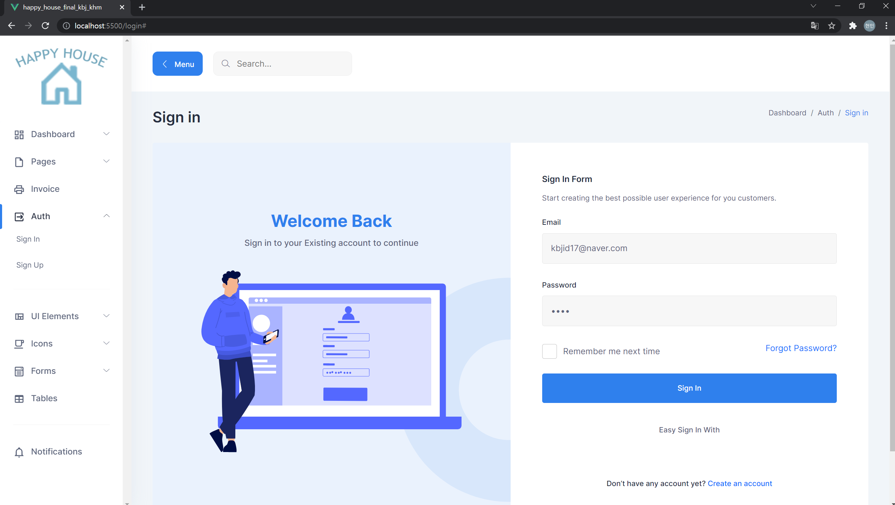
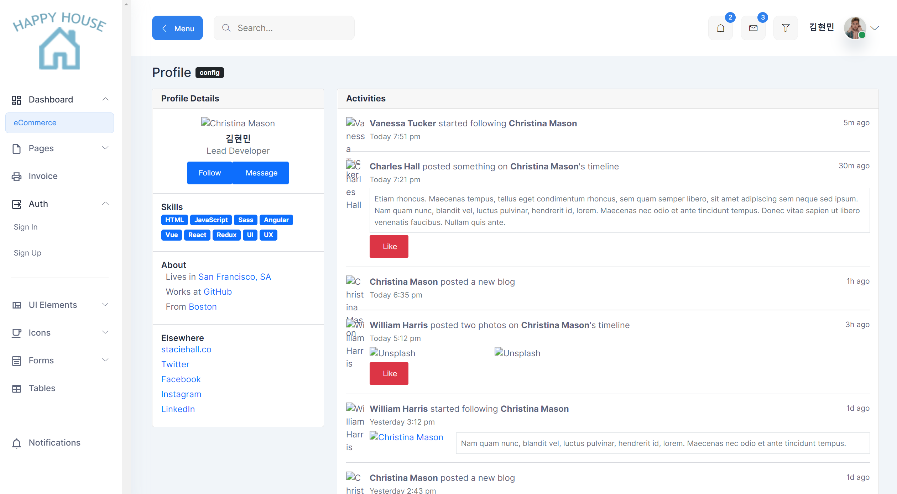
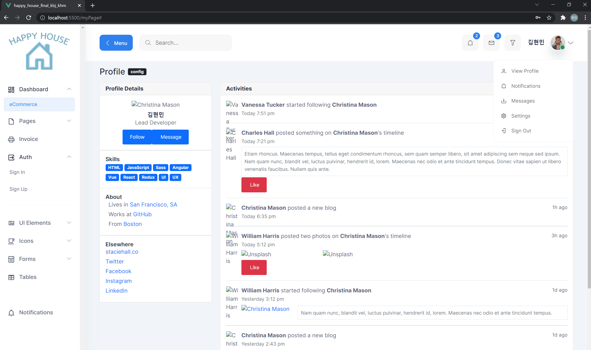
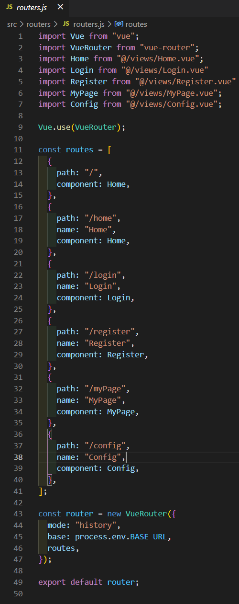
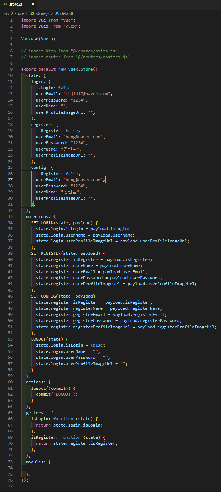

# Happy_House_6_Vue_김범주_김현민

### 참여자
* 김범주
* 김현민

# 프로젝트를 실행하기 전
* Single Page Web 형태로 구현하였습니다.

* 회원부분 구현 중.

# 메인 화면
* home화면에 동영상 파일과 문구로 이목을 끌 수 있게 제작하였습니다.
* Auto 메뉴만 구현되어 있습니다. 이후 메뉴들은 필요 기능에 따라 삭제되거나 수정될 예정.

* menu버튼 클릭시 사이드바가 나타나고 사라집니다.

* 모바일 화면 고려시.

# 회원 정보 관련
* 회원 가입, 로그인, 로그아웃 완료. 
* 회원정보 수정, 회원 탈퇴 시간 부족으로 미구현. 추후 구현 예정

### 회원 가입

### 로그인 화면

### 로그인 성공
* 로그인 하면 상단에 간단한 유저 프로필 등장.
* 추가로 유저 마이 페이지로 이동. UI 수정 중.

* 유저 프로필 클릭 시 드롭다운 메뉴 등장.

### 로그 아웃
* 구현 완료. 드롭 다운 메뉴에 sign out 클릭시 로그아웃.

### 회원정보 수정
* 구현중

### 회원 탈퇴
* 구현중

### Router

### Store

